## Introduction to igraph

-   [Getting Started](#getting-started)
-   [Graphs](#graphs)
    -   [Some Definitions](#some-definitions)
    -   [From Graphs to People and Relationships](#from-graphs-to-people-and-relationships)
-   [Various Ways to Specify Graphs in `igraph`](#various-ways-to-specify-graphs-in-igraph)
    -   [Encoding a Graph by Hand](#encoding-a-graph-by-hand)
    -   [Special Graphs: Empty, Full, Ring](#special-graphs-empty-full-ring)
    -   [Special Graphs: Lattice, Tree, Star](#special-graphs-lattice-tree-star)
    -   [Special Graphs: Erdos-Renyi & Power-Law](#special-graphs-erdos-renyi-power-law)
-   [Putting Graphs Together](#putting-graphs-together)
-   [Rewiring](#rewiring)
-   [Vertex and Edge Attributes](#vertex-and-edge-attributes)
-   [Adjacency Matrices](#adjacency-matrices)
-   [Community Structure](#community-structure)
-   [Laying Out Graphs By Hand](#laying-out-graphs-by-hand)
-   [Plotting Affiliation Graphs](#plotting-affiliation-graphs)

Back to [main page](README.md).

### Getting Started

-   `igraph` is a package that provides tools for the analysis and visualization of networks

``` r
library(igraph)
```

### Graphs

#### Some Definitions

**Graph:** A collection of vertices (or nodes) and undirected edges (or ties), denoted 𝒢(*V*, *E*), where *V* is a the vertex set and *E* is the edge set.

**Digraph (Directed Graph):** A collection of vertices (or nodes) and directed edges.

**Bipartite Graph:** Graph where all the nodes of a graph can be partitioned into two sets 𝒱<sub>1</sub> and 𝒱<sub>2</sub> such that for all edges in the graph connects and unordered pair where one vertex comes from 𝒱<sub>1</sub> and the other from 𝒱<sub>2</sub>. Often called an "affiliation graph" as bipartite graphs are used to represent people's affiliations to organizations or events.

#### From Graphs to People and Relationships

-   The vertices of the graph represent the actors in the social system. These are usually individual people, but they could be households, geographical localities, institutions, or other social entities.
-   The edges of the graph represent the relations between these entities (e.g., "is friends with" or "has sexual intercourse with" or "sends money to"). These edges can be directed undirected (e.g., "within 2 meters of") or directed (e.g., "sends money to"), in the case of a **digraph**.
-   Graphs (and digraphs) can be binary (i.e., presence/absence of a relationship) or valued (e.g., "groomed five times in the observation period", "sent $100").
-   A graph (with no self-loops) with *n* vertices has ${n \\choose 2} = n(n-1)/2$ possible unordered pairs. This number (which can get very big!) is important for defining the density of a graph, i.e., the fraction of all possible relations that actually exist in a network.


### Various Ways to Specify Graphs in `igraph`

#### Encoding a Graph by Hand

-   Create a small, undirected graph of five vertices from a vector of vertex pairs

``` r
require(igraph)
g <- make_graph(c(1,2, 1,3, 2,3, 2,4, 3,5, 4,5), n=5, dir=FALSE)
plot(g, vertex.color="lightblue")
```

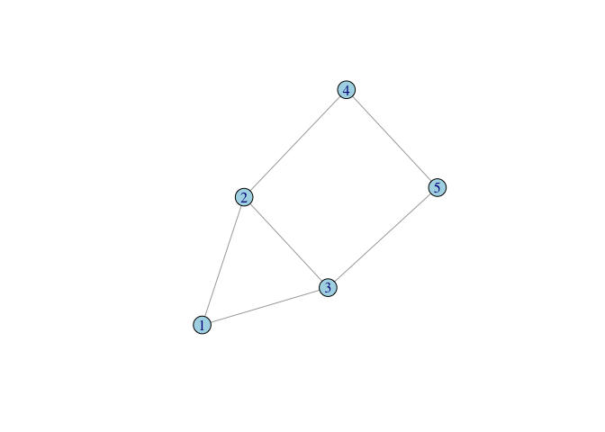

-   Create a small graph using `graph_from_literal()`
-   Undirected edges are indicated with one or more dashes `-`, `--`, etc. It doesn't matter how many dashes you use -- you can use as many as you want to make your code more readable.
-   The colon operator `:` links "vertex sets" -- i.e., creates ties between all members of two groups of vertices

``` r
g <- graph_from_literal(Fred-Daphne:Velma-Shaggy, Fred-Shaggy-Scooby)
plot(g, vertex.shape="none", vertex.label.color="black")
```


-   Make directed edges using `-+` where the plus indicates the direction of the arrow, i.e., `A --+ B` creates a directed edge from `A` to `B`
-   A mutual edge can be created using `+-+`

#### Special Graphs: Empty, Full, Ring

-   I really don't like the current default color in igraph, so I set the vertex color for every plot

``` r
# empty graph
g0 <- make_empty_graph(20)
plot(g0, vertex.color="lightblue", vertex.size=10, vertex.label=NA)
```

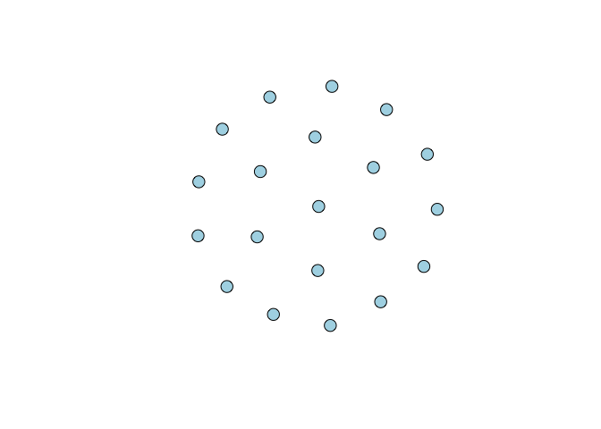

``` r
# full graph
g1 <- make_full_graph(20)
plot(g1, vertex.color="lightblue", vertex.size=10, vertex.label=NA)
```

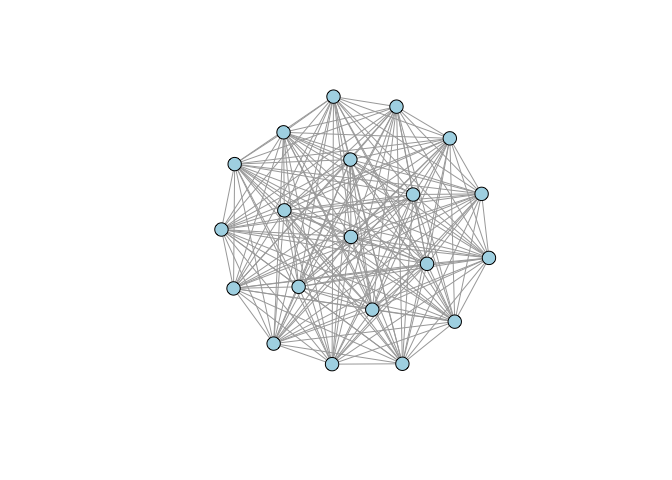

``` r
# ring
g2 <- make_ring(20)
plot(g2, vertex.color="lightblue", vertex.size=10, vertex.label=NA)
```

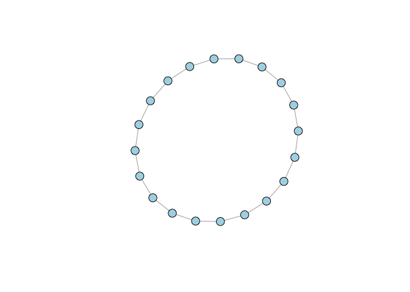

#### Special Graphs: Lattice, Tree, Star

``` r
# lattice
g3 <- make_lattice(dimvector=c(10,10))
plot(g3, vertex.color="lightblue", vertex.size=10, vertex.label=NA)
```


``` r
# tree
g4 <- make_tree(20, children = 3, mode = "undirected")
plot(g4, vertex.color="lightblue", vertex.size=10, vertex.label=NA)
```

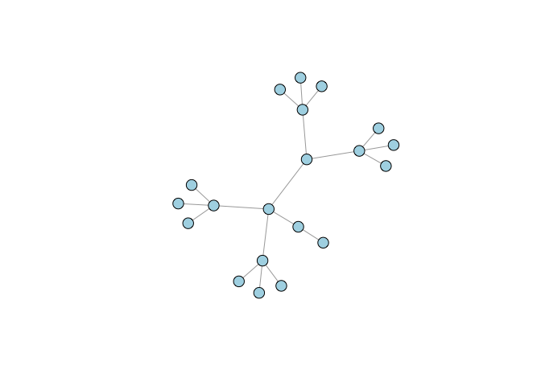

``` r
# star
g5 <- make_star(20, mode="undirected")
plot(g5, vertex.color="lightblue", vertex.size=10, vertex.label=NA)
```


#### Special Graphs: Erdos-Renyi & Power-Law

``` r
# Erdos-Renyi Random Graph
g6 <- sample_gnm(n=100,m=50)
plot(g6, vertex.color="lightblue", vertex.size=5, vertex.label=NA)
```

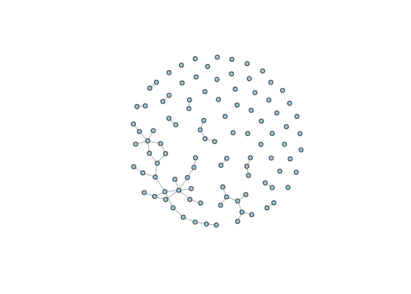

``` r
# Power Law
g7 <- sample_pa(n=100, power=1.5, m=1,  directed=FALSE)
plot(g7, vertex.color="lightblue", vertex.size=5, vertex.label=NA)
```

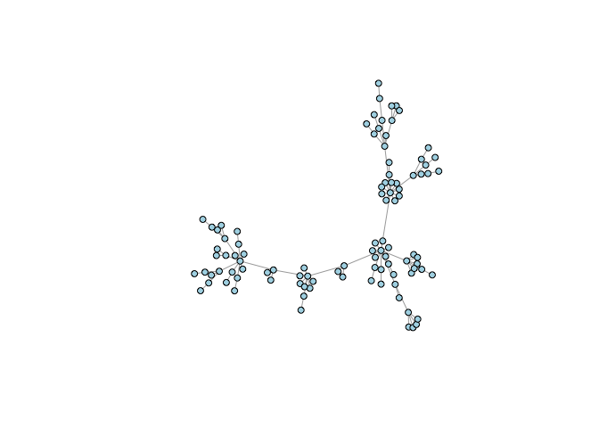

### Putting Graphs Together

-   Sometimes you want to plot two (or more) graphs together
-   The disjoint union operator allows you to merge two graphs with different vertex sets

``` r
plot(g4 %du% g7, vertex.color="lightblue", vertex.size=5, vertex.label=NA)
```

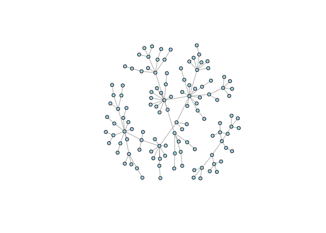

### Rewiring

-   Rewiring means rearranging the ties in a graph. It randomizes the connections between nodes without changing the degree distribution

``` r
gg <- g4 %du% g7
gg <- rewire(gg, each_edge(prob = 0.3))
plot(gg, vertex.color="lightblue", vertex.size=5, vertex.label=NA)
```

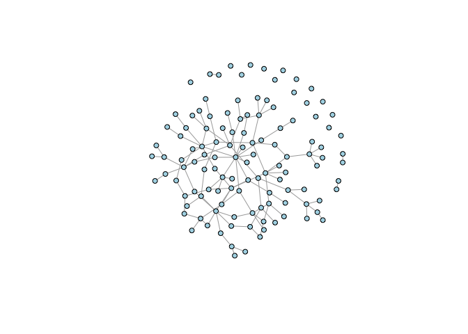

``` r
## retain only the connected component
gg <- induced.subgraph(gg, subcomponent(gg,1))
plot(gg, vertex.color="lightblue", vertex.size=5, vertex.label=NA)
```

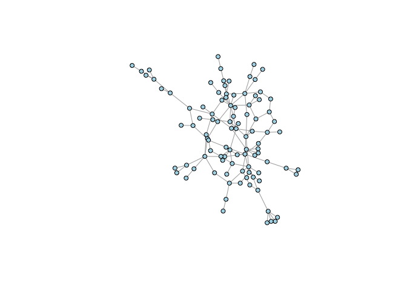

### Vertex and Edge Attributes

-   You can add arbitrary attributes to both vertices and edges. Generally, you do this to store information for plotting: colors, edge weights, names, etc.
-   Some attributes are automatically created when you construct an graph object (e.g., "name" or "weight" if you load a weighted adjacency matrix)
-   `V(g)` accesses vertex attributes
-   `E(g)` accesses edge attributes

``` r
## look at the structure
g4
```

    ## IGRAPH 52d3b03 U--- 20 19 -- Tree
    ## + attr: name (g/c), children (g/n), mode (g/c)
    ## + edges from 52d3b03:
    ##  [1] 1-- 2 1-- 3 1-- 4 2-- 5 2-- 6 2-- 7 3-- 8 3-- 9 3--10 4--11 4--12
    ## [12] 4--13 5--14 5--15 5--16 6--17 6--18 6--19 7--20

``` r
V(g4)$name <- LETTERS[1:20]
## see how it's changed
g4
```

    ## IGRAPH 52d3b03 UN-- 20 19 -- Tree
    ## + attr: name (g/c), children (g/n), mode (g/c), name (v/c)
    ## + edges from 52d3b03 (vertex names):
    ##  [1] A--B A--C A--D B--E B--F B--G C--H C--I C--J D--K D--L D--M E--N E--O
    ## [15] E--P F--Q F--R F--S G--T

``` r
## see what I did there?
## do some other stuff
V(g4)$vertex.color <- "Pink"
E(g4)$edge.color <- "SkyBlue2"
plot(g4, vertex.size=10, vertex.label=NA, vertex.color=V(g4)$vertex.color, 
     edge.color=E(g4)$edge.color, edge.width=3)
```

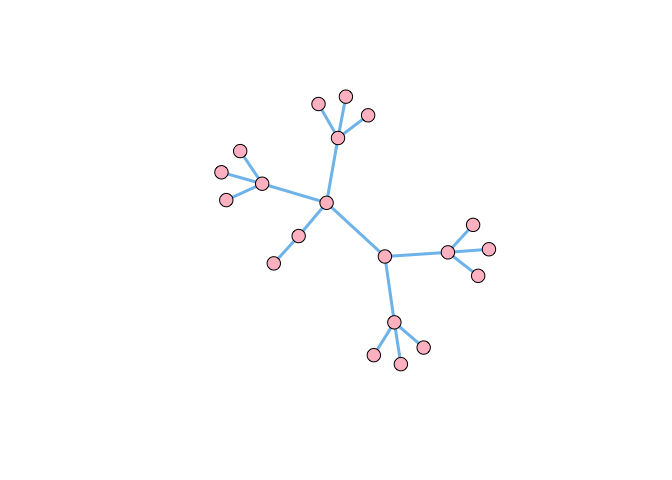

### Adjacency Matrices

-   Most primatologists/behavioral ecologists probably have experience thinking in terms of adjacency matrices
-   An example of an adjacency matrix is the pairwise interaction matrices (e.g., agonistic or affiliative interactions) that we construct from behavioral observations
-   A very important potential gotcha: when you read data into `R`, it will be in the form of a data frame. Converting an adjacency matrix to an `igraph` graph object requires the data to be in the `matrix` class. Therefore, you need to coerce the data you read in by wrapping your `read.table()` in an `as.matrix()` command.

``` r
kids <- as.matrix(
  read.table("http://web.stanford.edu/class/ess360/data/strayer_strayer1976-fig2.txt",
                             header=FALSE)
  )
kid.names <- c("Ro","Ss","Br","If","Td","Sd","Pe","Ir","Cs","Ka",
                "Ch","Ty","Gl","Sa", "Me","Ju","Sh")
colnames(kids) <- kid.names
rownames(kids) <- kid.names
g <- graph_from_adjacency_matrix(kids, mode="directed", weighted=TRUE)
lay <- layout_with_fr(g)
plot(g,edge.width=log2(E(g)$weight)+1, layout=lay, vertex.color="lightblue")
```

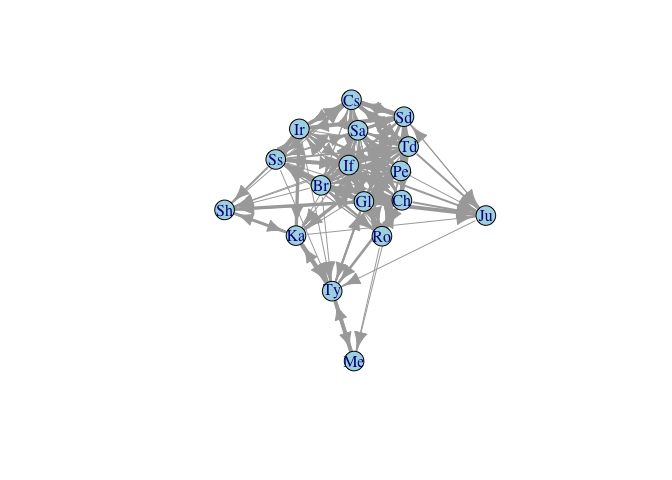

-   Adjacency matrices are actually very inefficient

-   Most sociomatrices are quite sparse

-   Cost of an adjacency matrix increases as *k*<sup>2</sup>

-   Edge Lists are much more efficient

### Community Structure

-   Various algorithms for detecting clusters of similar vertices -- i.e., "communities"
-   Use `fastgreedy.community()` to identify clusters in Kapferer's tailor shop and color the vertices based on their membership
-   `fastgreedy.community()` identifies four clusters
-   These clusters are listed as numbers in `fg$membership`
-   Use this vector to index vertex colors

``` r
A <- as.matrix(
  read.table(file="http://web.stanford.edu/class/ess360/data/kapferer-tailorshop1.txt", 
             header=TRUE, row.names=1)
  )
G <- graph.adjacency(A, mode="undirected", diag=FALSE)
fg <- fastgreedy.community(G)
cols <- c("blue","red","black","magenta")
plot(G, vertex.shape="none",
     vertex.label.cex=0.75, edge.color=grey(0.85), 
     edge.width=1, vertex.label.color=cols[fg$membership])
```

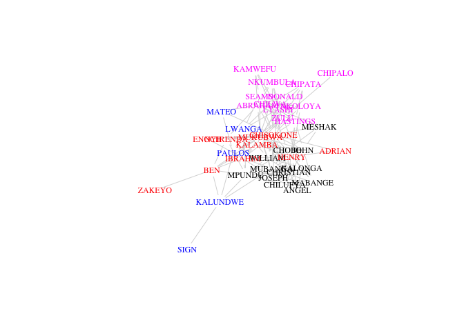

``` r
# another approach to visualizing
plot(fg,G,vertex.label=NA)
```


### Laying Out Graphs By Hand

-   The layout is of any given plot is random (e.g., plot the same graph repeatedly and you'll see that the layout changes with each plot)
-   `igraph` provides a tool for tinkering with the layout called `tkplot()`
-   Call `tkplot()` and it will open an X11 window (on Macs at least)
-   Select and drag the vertices into the layout you want, then use `tkplot.getcoords(gid)` to get the coordinates (where `gid` is the graph id returned when calling `tkplot()` on your graph)

<center>

</center>
``` r
g <- graph( c(1,2, 2,3, 1,3), n=3, dir=FALSE)
plot(g)
```

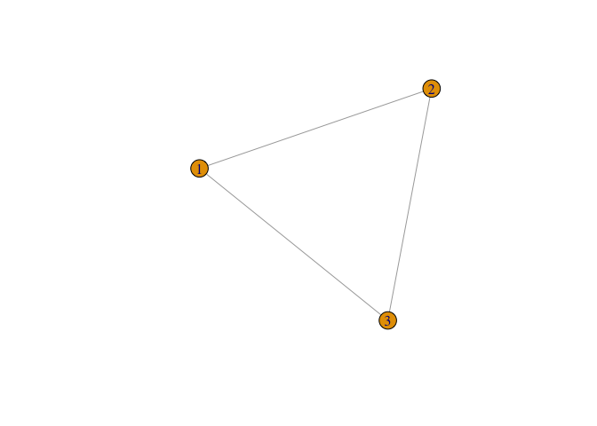

``` r
#tkplot(g)
#tkplot.getcoords(1)
### do some stuff with tkplot() and get coords which we call tri.coords
## tkplot(g)
## tkplot.getcoords(1) ## the plot id may be different depending on how many times you've called tkplot()
##     [,1] [,2]
##[1,]  228  416
##[2,]  436    0
##[3,]   20    0
tri.coords <- matrix( c(228,416, 436,0, 20,0), nr=3, nc=2, byrow=TRUE)
par(mfrow=c(1,2))
plot(g, vertex.color="lightblue")
plot(g, layout=tri.coords, vertex.color="lightblue")
```


### Plotting Affiliation Graphs

``` r
davismat <- as.matrix(
  read.table(file="http://web.stanford.edu/class/ess360/data/davismat.txt", 
            row.names=1, header=TRUE)
  )
southern <- graph_from_incidence_matrix(davismat) 
V(southern)$shape <- c(rep("circle",18), rep("square",14))
V(southern)$color <- c(rep("blue",18), rep("red", 14))
plot(southern, layout=layout.bipartite)
```

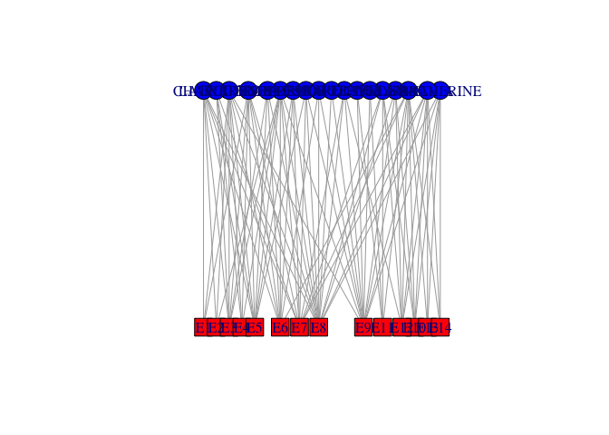

``` r
## not so beautiful
## did some tinkering using tkplot()...
x <- c(rep(23,18), rep(433,14))
y <- c(44.32432,   0.00000, 132.97297,  77.56757,  22.16216, 110.81081, 155.13514,
       199.45946, 177.29730, 243.78378, 332.43243, 410.00000, 387.83784, 354.59459,
       310.27027, 221.62162, 265.94595, 288.10811,   0.00000,  22.16216,  44.32432,
       66.48649,  88.64865, 132.97297, 166.21622, 199.45946, 277.02703, 365.67568,
       310.27027, 343.51351, 387.83784, 410.00000)
southern.layout <- cbind(x,y)
plot(southern, layout=southern.layout)
```

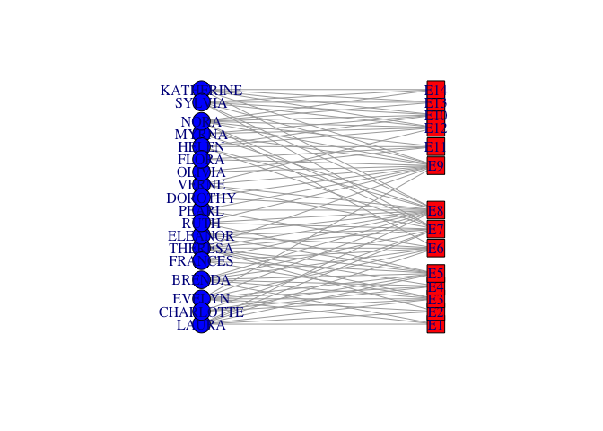

-   The incidence matrix is *n* × *k*, where *n* is the number of actors and *k* is the number of events
-   Project the incidence matrix *X* into social space, creating a sociomatrix *A*, **A** = **X** **X**<sup>*T*</sup>
-   This transforms the *n* × *k* into an *n* × *n* sociomatrix

``` r
#Sociomatrix
(f2f <- davismat %*% t(davismat))
```

    ##           EVELYN LAURA THERESA BRENDA CHARLOTTE FRANCES ELEANOR PEARL RUTH
    ## EVELYN         8     6       7      6         3       4       3     3    3
    ## LAURA          6     7       6      6         3       4       4     2    3
    ## THERESA        7     6       8      6         4       4       4     3    4
    ## BRENDA         6     6       6      7         4       4       4     2    3
    ## CHARLOTTE      3     3       4      4         4       2       2     0    2
    ## FRANCES        4     4       4      4         2       4       3     2    2
    ## ELEANOR        3     4       4      4         2       3       4     2    3
    ## PEARL          3     2       3      2         0       2       2     3    2
    ## RUTH           3     3       4      3         2       2       3     2    4
    ## VERNE          2     2       3      2         1       1       2     2    3
    ## MYRNA          2     1       2      1         0       1       1     2    2
    ## KATHERINE      2     1       2      1         0       1       1     2    2
    ## SYLVIA         2     2       3      2         1       1       2     2    3
    ## NORA           2     2       3      2         1       1       2     2    2
    ## HELEN          1     2       2      2         1       1       2     1    2
    ## DOROTHY        2     1       2      1         0       1       1     2    2
    ## OLIVIA         1     0       1      0         0       0       0     1    1
    ## FLORA          1     0       1      0         0       0       0     1    1
    ##           VERNE MYRNA KATHERINE SYLVIA NORA HELEN DOROTHY OLIVIA FLORA
    ## EVELYN        2     2         2      2    2     1       2      1     1
    ## LAURA         2     1         1      2    2     2       1      0     0
    ## THERESA       3     2         2      3    3     2       2      1     1
    ## BRENDA        2     1         1      2    2     2       1      0     0
    ## CHARLOTTE     1     0         0      1    1     1       0      0     0
    ## FRANCES       1     1         1      1    1     1       1      0     0
    ## ELEANOR       2     1         1      2    2     2       1      0     0
    ## PEARL         2     2         2      2    2     1       2      1     1
    ## RUTH          3     2         2      3    2     2       2      1     1
    ## VERNE         4     3         3      4    3     3       2      1     1
    ## MYRNA         3     4         4      4    3     3       2      1     1
    ## KATHERINE     3     4         6      6    5     3       2      1     1
    ## SYLVIA        4     4         6      7    6     4       2      1     1
    ## NORA          3     3         5      6    8     4       1      2     2
    ## HELEN         3     3         3      4    4     5       1      1     1
    ## DOROTHY       2     2         2      2    1     1       2      1     1
    ## OLIVIA        1     1         1      1    2     1       1      2     2
    ## FLORA         1     1         1      1    2     1       1      2     2

``` r
gf2f <- graph_from_adjacency_matrix(f2f, mode="undirected", diag=FALSE, add.rownames=TRUE)
gf2f <- simplify(gf2f)
plot(gf2f, vertex.color="lightblue")
```

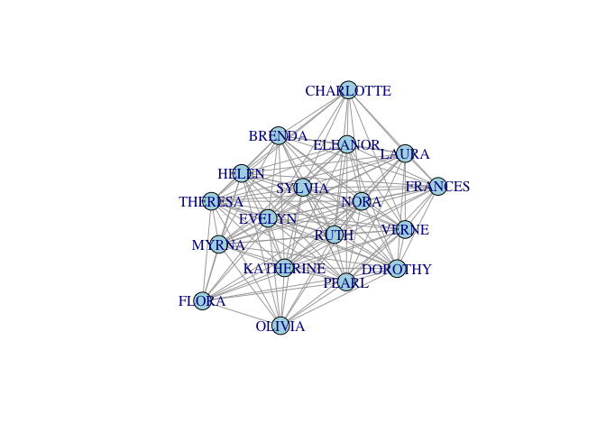

``` r
## who is the most central?
cb <- betweenness(gf2f)
#plot(gf2f,vertex.size=cb*10, vertex.color="lightblue")
plot(gf2f,vertex.label.cex=1+cb/2, vertex.shape="none")
```


-   Project the matrix into event space

``` r
### this gives you the number of women at each event (diagonal) or mutually at 2 events
(e2e <- t(davismat) %*% davismat)
```

    ##     E1 E2 E3 E4 E5 E6 E7 E8 E9 E10 E11 E12 E13 E14
    ## E1   3  2  3  2  3  3  2  3  1   0   0   0   0   0
    ## E2   2  3  3  2  3  3  2  3  2   0   0   0   0   0
    ## E3   3  3  6  4  6  5  4  5  2   0   0   0   0   0
    ## E4   2  2  4  4  4  3  3  3  2   0   0   0   0   0
    ## E5   3  3  6  4  8  6  6  7  3   0   0   0   0   0
    ## E6   3  3  5  3  6  8  5  7  4   1   1   1   1   1
    ## E7   2  2  4  3  6  5 10  8  5   3   2   4   2   2
    ## E8   3  3  5  3  7  7  8 14  9   4   1   5   2   2
    ## E9   1  2  2  2  3  4  5  9 12   4   3   5   3   3
    ## E10  0  0  0  0  0  1  3  4  4   5   2   5   3   3
    ## E11  0  0  0  0  0  1  2  1  3   2   4   2   1   1
    ## E12  0  0  0  0  0  1  4  5  5   5   2   6   3   3
    ## E13  0  0  0  0  0  1  2  2  3   3   1   3   3   3
    ## E14  0  0  0  0  0  1  2  2  3   3   1   3   3   3

``` r
ge2e <- graph_from_adjacency_matrix(e2e, mode="undirected", diag=FALSE, add.rownames=TRUE)
ge2e <- simplify(ge2e)
plot(ge2e, vertex.color="lightblue")
```

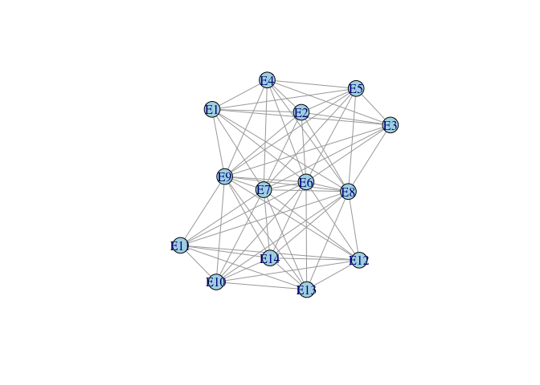
